# Настройка инфраструктуры

Эта лабораторная работа содержит технические сведения, описания и практические задания, связанные с созданием инфраструктуры для обучения и инференса
моделей машинного обучения (Machine Learning, ML) и больших языковых моделей (Large Language Model, LLM).

# Оглавление

[Анализ характеристик и возможностей больших языковых моделей (LLM) на примере LLM Qwen](#Анализ-характеристик-и-возможностей-больших-языковых-моделей-LLM-на-примере-Qwen)

[Создание виртуального сервера для LLM](#Создание-виртуального-сервера-для-LLM)

[Фреймворки для установки и использования LLM](#Фреймворки-для-установки-и-использования-LLM)
- [ollama](#ollama)
- [vllm и AWQ](#vllm-и-AWQ)
- [llama.cpp](#llama.cpp)
 
# Анализ характеристик и возможностей больших языковых моделей LLM на примере Qwen

Описание, техническая информация: https://huggingface.co/Qwen.

Под конкретные задачи (кодогенерация, анализ документов и т.д.) есть специализированные версии — например, Qwen3-Coder для программирования или Qwen3-VL для работы с изображениями.

Для ознакомления с возможностями LLM Qwen - Qwen3-8B — идеальный стартовый вариант: 8 млрд параметров, поддержка 119 языков, контекст до 128K токенов, обучена на ~36 трлн токенов. 
Хорошо справляется с общими задачами, кодом и рассуждениями.

Qwen3-14B — если нужны более сложные рассуждения и лучшее качество генерации при умеренных ресурсах.

Для очень ограниченных ресурсов: Qwen3-4B или Qwen3-1.7B (но с заметным падением качества).
Qwen3-8B в 4-bit квантовании (AWQ или GGUF) — это даст ~70-80% качества полной версии при минимальных требованиях к памяти.
Для квантованных версий надо выбирать модели с тегами в названии: -AWQ или -GGUF.

|Модель|Полная точность (FP16)|4-bit квантование, AWQ/GGUF снижают требования к VRAM примерно в два раза|Рекомендуемые характеристики виртуальной машины|
|:----:|:--------------------:|:-----------------------------------------------------------------------:|:---------------------------------------------:|
|Qwen3-8B|14–16 GB VRAM	|6–8 GB VRAM|GPU: RTX 3060 12GB / A4000 CPU: 8+ ядер, 32 GB RAM, 50 GB SSD (хранение моделей и кешей)|
|Qwen3-14B|24–28 GB VRAM|10–12 GB VRAM|GPU: RTX 4090 / A5000 CPU: 12+ ядер, 32 GB RAM, 80 GB SSD

RTX3060 для домашних компьютеров, не оптимизирована для работы 24/7. A4000 для профессиональных машин

Запуск Qwen-8B только на CPU возможен, но требует корректировки ожиданий (😊) и ресурсов.
|Параметр|Минимум|Рекомендовано|Комфортно|
|:------:|:-----:|:-----------:|:-------:|
|RAM|	16 ГБ |	24 Гб |	32 ГБ |
|Ядра CPU |	4	| 8	| 12+ |
|Тип инструкций | AVX2	| AVX2	| AVX-512 |
|Емкость и тип диска	| 20 ГБ SSD	| 30 ГБ SSD	| 50 ГБ SSD |
|Ожидаемая производительность	| 0.5–1 токен/сек	| 2–4 токен/сек	| 4–8 токен/сек |

При запуске на CPU модель полностью загружается в оперативную память CPU (а не в видеопамять GPU). 
Если памяти окажется недостаточно, то система начнет использовать своп-память и скорость упадет на порядки.
Скорость растет линейно с числом ядер. Для 8 ядер — комфортная генерация 2–4 токена/сек.
HDD существенно замедлит загрузку модели (десятки минут с HDD вместо десятков секунд с SSD)

[Назад к Оглавлению] (#Оглавление)
 
# Создание виртуального сервера для LLM

Наилучшим вариантом является отдельный сервер с GPU, однако такой вариант не всегода недоступен, кроме того, в лабораторных работах понадобится несколько серверов. 
Поэтому наилучшим вариантом является виртуализация на рабочем компьютере и аренда виртуальных мощностей у провайдеров облачных сервисов (yandex cloud, cloud.ru и т.п.).

Далее описан пример создания и настройки виртуальной машине в Yandex Cloud.

Рабочая консоль https://console.yandex.cloud/
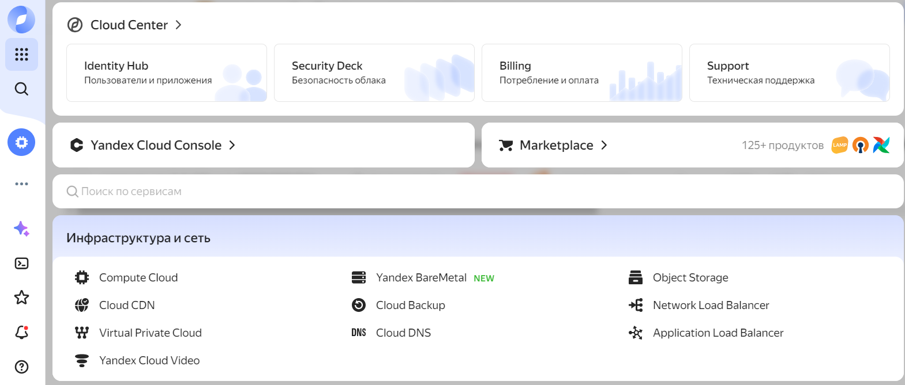
 
Compute cloud
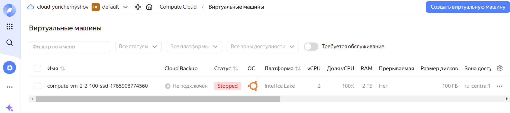

Создать виртуальную машину
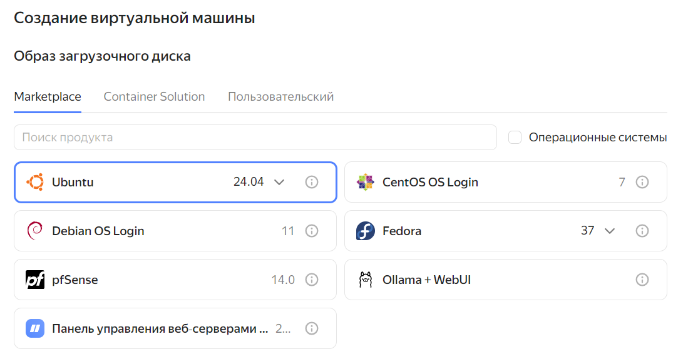

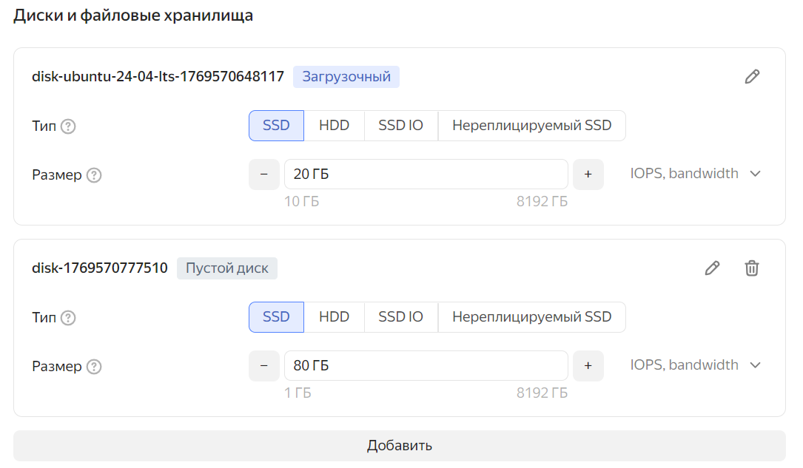

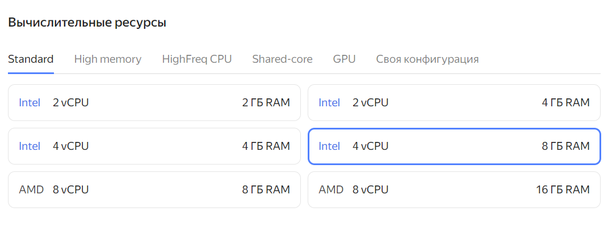

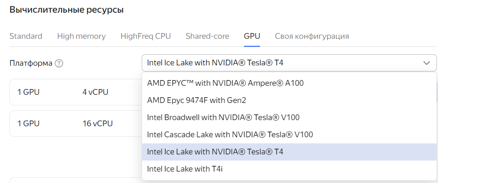

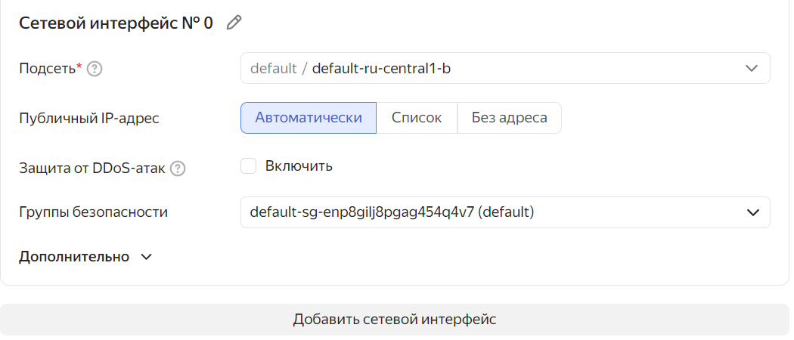

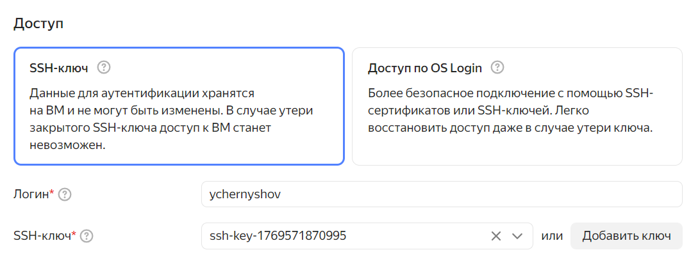

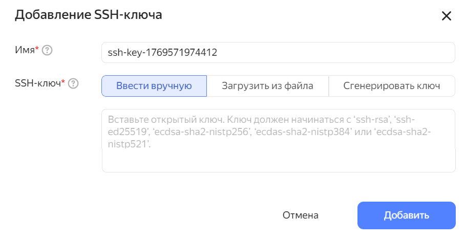

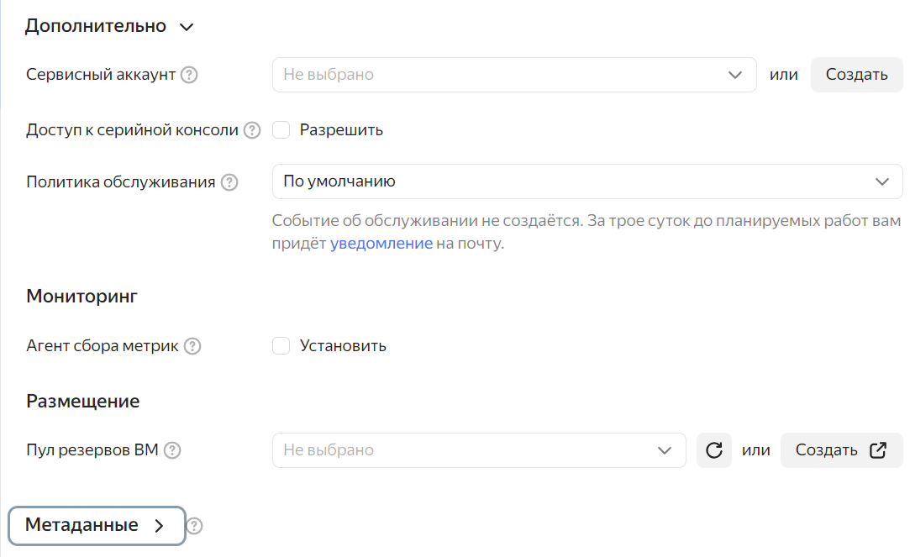


Из соображений цены (удобный калькулятор сразу же делает расчет после выбираемых компонентов виртуальной инфраструктуры) выбираем Nvidia T4.
NVIDIA Tesla T4 — это профессиональная видеокарта (ускоритель) для дата-центров, выпущенная в 2018 году на архитектуре Turing. 
Она специализируется на инференсе (выводе) ИИ-моделей и широко используется в облачных сервисах.
 
Наконец, мы добрались до самой важной кнопки – «Создать ВМ». Можно правда нажать и кнопку «Отменить».
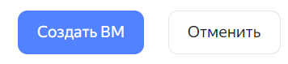 

Минусы и ограничения GPU T4
Устаревшая архитектура (Turing 2018 г.) — медленнее современных карт (Ampere/Ada) на 30–50% при одинаковом объёме памяти
Нет поддержки новых инструкций — например, для ускорения квантования AWQ работают хуже, чем на картах с архитектурой Ampere+
Мало вычислительной мощности в FP16 — не подходит для тренировки моделей, только для инференса

Установка драйверов NVIDIA для различных моделей GPU (Tesla, Turing, Ampere, Volta и др.) для разных операционных систем (Ubuntu 24.04 LTS и др.) 
требует внимания к архитектуре карты и особенностям операционной системы. 
Рекомендуется перед установкой изучить рекомендации на сайте nvidia и на сайтах разработчиков используемой операционной системы. Например
•	Nvidia Datacenter Drivers https://docs.nvidia.com/datacenter/tesla/drivers/index.html
•	https://ubuntu.com/blog/nvidia-open-gpu-kernel-modules-ubuntu-24-04

Для мониторинга GPU Nvidia используется утилита `nvidia-smi`. Если ее нет, то наверняка не установлены драйверы. 
Посмотреть доступные устройства можно с помощью команды `ubuntu-drivers devices`, 
если ее нет, то установить `apt install ubuntu-drivers-common`

```bash
$ ubuntu-drivers devices
```
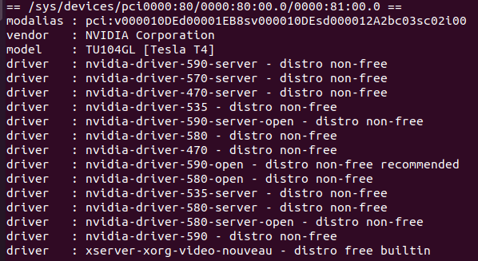

```bash
$ ubuntu-drivers autoinstall
```

Важно: нужен reboot!

Проверить загрузку ядра модуля
```bash
$ lsmod | grep nvidia
```

Проверить логи
```bash
$ dmesg | grep -i nvidia
$ journalctl -xe | grep -i nvidia
```


# Фреймворки для установки и использования LLM

Итак, у нас есть рабочий сервер с GPU с установленными драйверами nvidia. Попробуем использовать разные фреймворки для того, чтобы поработать с моделью.

##ollama

Подходит для первичного знакомства, автоматически скачивает квантованную модель (GGUF), минимум конфигурации, работает даже на CPU. Подходит для быстрого тестирования

Программное обеспечение доступно для скачивания по ссылке https://ollama.com/download

Для скачивания и установки ollama для операционной системы Ubuntu используется утилита curl. 
Перед использованием рекомендуется проверять содержание исполняемых файлов, например содержание файла install.sh.

```bash
$ curl -fsSL https://ollama.com/install.sh | sh
$ ollama run qwen3:4b
Created symlink /etc/systemd/system/default.target.wants/ollama.service → /etc/systemd/system/ollama.service.
WARNING: No NVIDIA/AMD GPU detected. Ollama will run in CPU-only mode.
```

Рекомендуется проанализировать: сколько установка заняла места на жестком диске и в какие папки произошла инсталляция.

```bash
$ sudo systemctl status ollama
● ollama.service - Ollama Service
     Loaded: loaded (/etc/systemd/system/ollama.service; enabled; vendor preset: enabled)
     Active: active (running) since Thu 2026-01-22 08:35:20 +05; 4min 0s ago
   Main PID: 4526 (ollama)
      Tasks: 7 (limit: 9817)
     Memory: 37.4M
     CGroup: /system.slice/ollama.service
             └─4526 /usr/local/bin/ollama serve

$ sudo netstat -tlpn | grep ollama
tcp        0      0 127.0.0.1:11434         0.0.0.0:*               LISTEN      4526/ollama         
```

## Vllm с поддержкой AWQ

Фреймвокр vllm поддерживает OpenAI-совместимый API. AWQ является одним из способов квантования, сохраняет около 95% качества при 4-bit квантовании (зависит от модели LLM). 
Квантованные модели доступны на Hugging Face Hub: Qwen/Qwen3-8B-AWQ, Qwen/Qwen3-14B-AWQ.

Шаг 1. Установка vLLM
```bash
$ pip install "vllm>=0.8.0"
```

Шаг 2. Запуск сервера с квантованной моделью (пример для Qwen3-8B-AWQ)
```bash
$ python -m vllm.entrypoints.openai.api_server \
  --model Qwen/Qwen3-8B-AWQ \
  --quantization awq \
  --port 8000
```

Установка с dockerfile (хороший вариант для продакшн)
Готовые образы доступны на Docker Hub: vllm/vllm-openai 
Для корпоративного использования рекомендуется контейнеризация с мониторингом ресурсов

Пример Dockerfile для vLLM

```docker
FROM vllm/vllm-openai:latest
RUN pip install transformers
CMD ["--model", "Qwen/Qwen3-8B-AWQ", "--quantization", "awq"]
```

Также рекомендуется установить OpenWebUI поверх vLLM для удобного веб-интерфейса

##llama.cpp

Установка без GPU с применением llama.cpp

Для тестирования без GPU попробуйте llama.cpp + GGUF — работает даже локально на ноутбуке (но с хорошими характеристиками).

Шаг 1: Выберите квантованную модель в формате GGUF
Скачайте с одного из источников:
Hugging Face Hub: Qwen/Qwen3-8B-GGUF → файл qwen3-8b-Q4_K_M.gguf (~4.7 ГБ)
TheBloke (популярный квантовщик): TheBloke/Qwen3-8B-GGUF
Рекомендуется Q4_K_M — лучший баланс скорости и качества для CPU.

Шаг 2 llama.cpp
Клонируем репозиторий
```bash
$ git clone https://github.com/ggerganov/llama.cpp && cd llama.cpp
```

Собираем с оптимизациями под ваш CPU (автоматически определит AVX2/AVX-512)
```bash
$ make -j LLAMA_AVX=1 LLAMA_AVX2=1 LLAMA_FMA=1
```

Или проще — установка через pip (менее оптимально, но быстрее)
```bash
$ pip install llama-cpp-python
```

Шаг 3: запуск через llama.cpp
Пример запуска с 8 потоками (ядро/поток)
```bash
$ ./main -m ./qwen3-8b-Q4_K_M.gguf \
       -p "Привет! Расскажи о себе." \
       -n 256 \
       -t 8 \
       --temp 0.7
```

Параметры:
-t 8 — использовать 8 потоков CPU
-n 256 — сгенерировать до 256 токенов
--threads можно увеличить до числа логических ядер вашей ВМ

Советы для оптимизации на CPU
Всегда используйте 4-bit квантование (Q4_K_M) — разница в качестве почти незаметна, а скорость выше на 40%.
Ограничьте длину контекста — добавьте флаг -c 2048 вместо полных 32К токенов.
Выделите ВМ с максимальным числом ядер — для облака лучше 8 ядер × 3 ГГц, чем 4 ядра × 4 ГГц.
Избегайте фоновых процессов — остановите ненужные сервисы для освобождения памяти.

#Установка и использование langchain

Функция	Что делает	Синтаксис
ChatOllama()	Инициализация локальной модели	ChatOllama(model="llama3.2", temperature=0.7)
invoke()	отправляет запрос к модели	llm.invoke("текст") → ответ
stream()	возвращает ответ по частям	llm.stream("текст") 
batch()	отправляет несколько запросов параллельно	llm.batch(["q1", "q2"]) 
ChatPromptTemplate.from_template()	Шаблон с переменной	ChatPromptTemplate.from_template("{var}")
ChatPromptTemplate.from_messages()	Шаблон с ролями	from_messages([("system", "..."), ("human", "...")])
StrOutputParser()	Извлечение текста из ответа	parser.invoke(ai_message) → строка
LCEL (промпт | llm | парсер)	Создание цепочки	chain = prompt | llm | parser
.content	извлекает текст из ответа	response.content


#Простые сценарии red teaming LLM

В заключении этой части рассмотрим запуск в настроенной инфраструктуре некоторых простых сценариев поиска уязвимостей в больших языковых моделях (red teaming LLM).

Обратите внимание, что при выполнении этих экспериментов необходимо соблюдать этические и правовые органичения.
В частности, необходимо для выполнения этой части обучения использовать изолированную сред (изолированные виртуальные машины, без выхода в Интернет).
Описанные ниже скрипты должны выполняться только на собственных виртуальных машин, категорически запрещается выполнять атакующие действия против внешний ресурсов (в том числе облачных LLM).

Целью является демонстрация возможных уязвимостей LLM для того, чтобы обучающиеся лучше могли оценит угрозы и методы их реализации, 
организовать более эффективную защиту реальных систем искусственного интеллекта (LLM, ИИ агенты).
Все действия соответствуют OWASP Top 10 for LLM Applications (2024).

Подготовка инфраструктуры
Архитектура тестового полигона
|:-:|:-:|
|ОС|Роль|
|:-:|:-:|
|Ubuntu 24.04|Сервер Ollama + LLM|
|:-:|:-:|
|Kali Linux 2024.x|red team host|		
|:-:|:-:|

Сеть: Host-only (VirtualBox) или Internal Network (VMware) — без доступа в интернет!

Установка ollama
```bash
$ curl -fsSL https://ollama.com/install.sh | sh
$ sudo systemctl enable ollama
```

Загрузка модели
```
$ ollama pull qwen:0.5b
```

Настройка сетевого доступа

Разрешить подключения только с локальной сети (192.168.56.0/24)

``bash
$ sudo mkdir -p /etc/systemd/system/ollama.service.d
$ sudo tee /etc/systemd/system/ollama.service.d/override.conf > /dev/null <<EOF
[Service]
Environment="OLLAMA_HOST=0.0.0.0"
Environment="OLLAMA_ORIGINS=http://ваш локальный IP "
EOF

$ sudo systemctl daemon-reexec
$ sudo systemctl restart ollama
```

После этого должен запуститься сервис ollama и по curl запросу вернуть список моделей

```bash
$curl http://localhost:11434/api/tags
```

## Сценарий 1: Промпт инъекция

## Сценарий 2: Token bomb

## Сценарий 3: Burp suite

Запустить burpsuit в графическом режиме на Kali
burpsuite &


