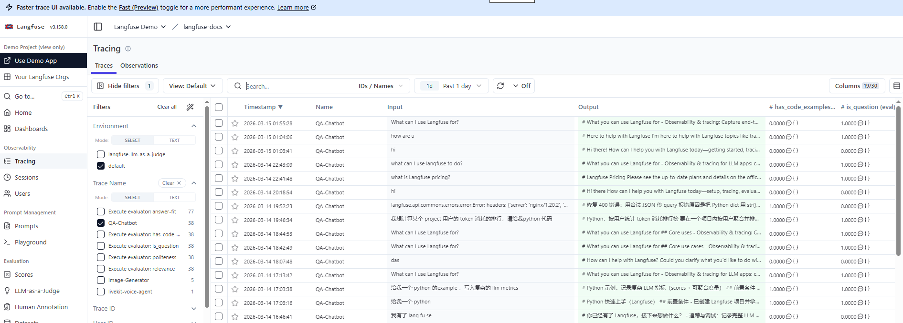
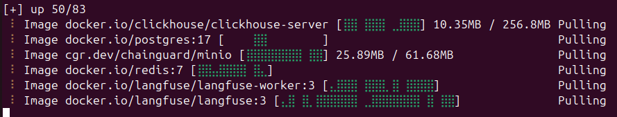
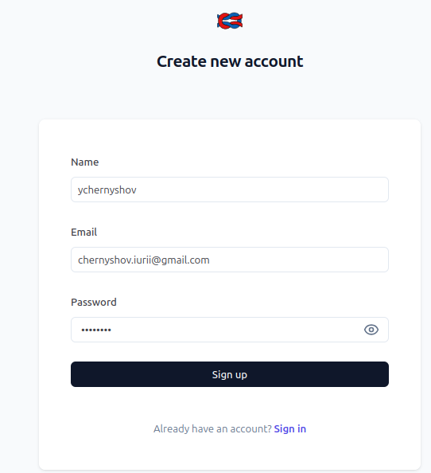
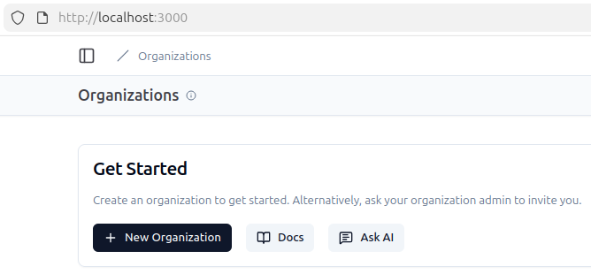
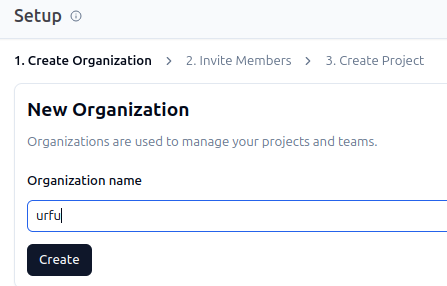
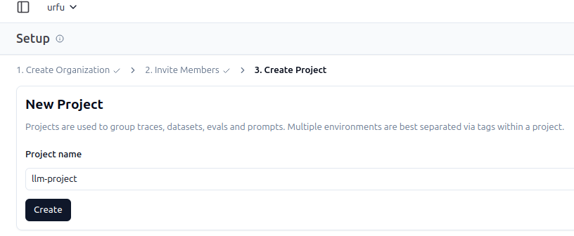
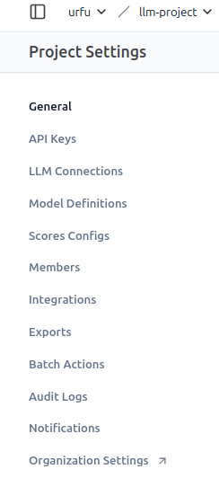
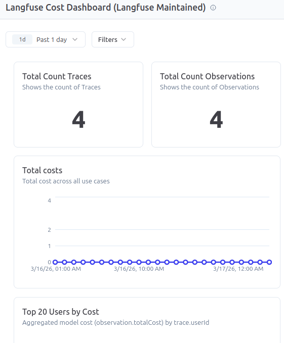
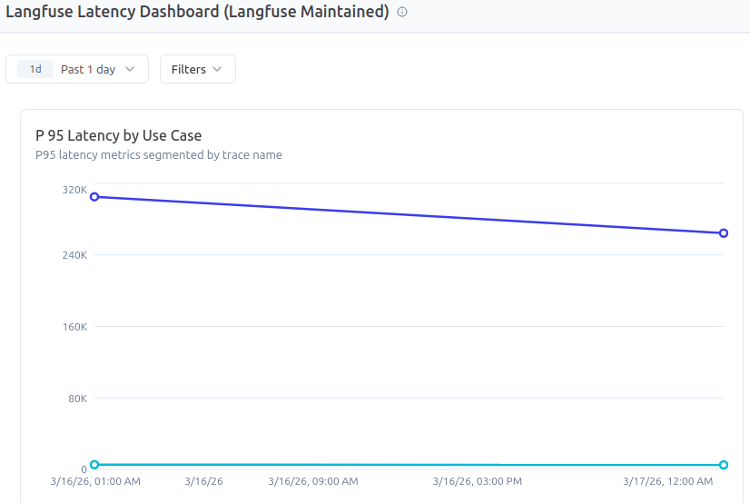

# Мониторинг и анализ работы LLM-приложений с помощью Langfuse

# Оглавление

[Теоретические сведения](#Теоретические-сведения)

[Цели работы](#Цели-работы)

[Настройка параметров проекта и переменных окружения](#Настройка-параметров-проекта-и-переменных-окружения)

[Базовая интеграция](#)

[Трассировка работы LLM](#Трассировка-работы-LLM)

[Трассировка сложной цепочки (Spans)](#Трассировка-сложной-цепочки-(Spans))

[Оценка качества](#Оценка-качества)

[Анализ метрик и затрат](#Анализ-метрик-и-затрат)

[Контрольные вопросы](#Контрольные-вопросы)

[Ссылки](#Ссылки)

# Теоретические сведения

В информационных системах, использующих в своей работе LLM связанные технологии (RAG, агент ИИ, MCP) происходит сложных информационный обмен между компонентами системы. 
Выход из одного компонента поступает на вход другого компонента. 
При этом выход компонента может быть сгенерирован с помощью LLM, а значит, не исключен вариант галлюцинирования, ошибок модели. 
Такие ошибки очень сложно диагностировать при сложном взаимодействии процессов. Поэтому очень полезными являются системы мониторинга и контроля внутренних взаимодействий процессов в LLM системах.

Langfuse — это платформа с открытым исходным кодом для отладки, мониторинга и управления LLM-приложениями. 

Репозиторий проекта: [https://github.com/langfuse/langfuse].

Основные части langfuse: 
- система сбора телеметрии работы приложения (т.е. информации о действиях, данных мониторинга)
- графический web-интерфейс для визуализации результатов анализа, в котором можно контролировать каждое действие в LLM-приложении.

Langfuse для работы требует интеграции в исходный код приложения (есть специальный python SDK).

Основные сущности, с которыми работает Langfuse:
•	Traces (Трассировки): визуализация полного пути запроса через цепочку вызовов (цепочки, агенты, RAG), это корневой объект, объединяющий все действия по одному пользовательскому запросу.
•	Observations (Наблюдения): из них состоят трейсы, детальная информация о каждом шаге (вход, выход, токены, модель), возможные виды:
o	Span: логический блок кода (например, "Поиск в базе знаний", "Генерация ответа").
o	Generation: вызов самой языковой модели (содержит токены, стоимость, модель).
o	Events (события) – текстовые сообщения, логи
•	Scores (Оценки): возможность оценивать качество ответов (ручная оценка пользователем или автоматическая оценка другой моделью).
•	Prompt Management: управление версиями промптов, создание в UX/UI.
По сути, langfuse представляет собой «приборную панель» для мониторинга работы приложений с LLM.
 

# Цели работы

Изучить принципы мониторинга LLM-приложений (трассировка, логирование, метрики).
Освоить инструмент Langfuse для наблюдения за работой цепочек вызовов моделей.
Научиться анализировать задержки (latency), стоимость (cost) и качество ответов (scores).
Реализовать интеграцию Langfuse в Python-приложение с использованием LLM.

# Настройка параметров проекта и переменных окружения

Проверка требований к окружению
•	доступ в Интернет для скачивания пакетов и регистрации в сервисе 
•	Python 3.8+.
•	Фреймворк Ollama для работы с локальными моделями LLM.

Установка из репозитория. Понадобятся установленные утилиты git и docker. Для docker потребуются права суперпользователя (sudo)
'''bash
$ git clone https://github.com/langfuse/langfuse.git
$ cd langfuse
$ docker compose up
'''

Зайдите в приложение http://localhost:3000/,
При первом входе в локальную версию langfuse понадобится зарегистрироваться (Sign Up), задать имя пользователя и пароль для дальнейшей работы.

После регистрации можно работать в персональном пользовательском кабинете приложения

 
Для дальнейшей работы потребуется создать Организацию и Проект

После создания проекта необходимо в разделе API Keys создать ключи доступа LANGFUSE_PUBLIC_KEY и LANGFUSE_SECRET_KEY и сохранить их.

После этого требуется установить соединение с LLM. Будем использовать локально установленный фреймворк ollama для которого уже скачаны различные модели LLM, вот числе используемый далее qwen3:4b.

 
# Базовая интеграция

Создайте файл basic_trace.py. Цель: отправить простой запрос к модели и увидеть его в дашборде.
Сначала необходимо создать основной трейс с помощью функции Langfuse trace для всего пайплайна. При этом задаются: имя трейса, имя пользователя юзера и любые полезные данные, которые требуется наблюдать в дашборде (поддерживаются все типы данных Python). 

# Трассировка работы LLM
Запустите скрипт.

Откройте дашборды Langfuse.
 

 
Найдите свой Trace. Сделайте скриншот вкладки Observations.

# Трассировка сложной цепочки (Spans)

Цель: показать, как мониторить многошаговые процессы (например, RAG или цепочку рассуждений).
Создайте файл complex_chain.py.
Запустите скрипт.
В дашборде изучите визуализацию Waterfall Chart (диаграмма Ганта для шагов).
Определите, какой шаг занял больше всего времени. Сделайте скриншот.

# Оценка качества
Добавим оценку вручную и программно.
Ручная оценка: В дашборде Langfuse найдите последний Trace из Шага 2. Вручную поставьте Score (например, 1 из 5) с комментарием.
Автоматическая оценка: Модифицируйте код basic_trace.py, добавив оценку после генерации.

'''python
    # ... после generation.end() ...
    
    trace.score(
        name="quality-check",
        value=1.0, # 1.0 - хорошо, 0.0 - плохо
        comment="Автоматическая проверка: ответ не пустой"
    )
'''

В дашборде перейдите в раздел Scores.
Проанализируйте график распределения оценок. Сделайте скриншот.

# Анализ метрик и затрат
В дашборде Langfuse перейдите в раздел Dashboard (или Analytics).
Изучите метрики:
- Average Latency (средняя задержка).
- Total Tokens (общее количество токенов).
- Cost (если настроены цены на модели).

Попробуйте отфильтровать данные по user_id или name_trace

LLM-as-a-Judge

# Контрольные вопросы
- В чем разница между сущностями Trace, Span и Generation в Langfuse?
- Зачем нужно вызывать метод flush() в конце работы скрипта?
- Как Langfuse помогает выявлять "узкие места" (bottlenecks) в работе LLM-приложения?
- Какие данные передаются на сервер Langfuse и какие меры безопасности стоит учитывать при работе с чувствительными данными (PII)?
- Как можно использовать Langfuse для A/B тестирования промптов?

# Cсылки
- Официальная документация Langfuse: langfuse.com/docs
- GitHub репозиторий: github.com/langfuse/langfuse
- Примеры интеграции: langfuse.com/examples
